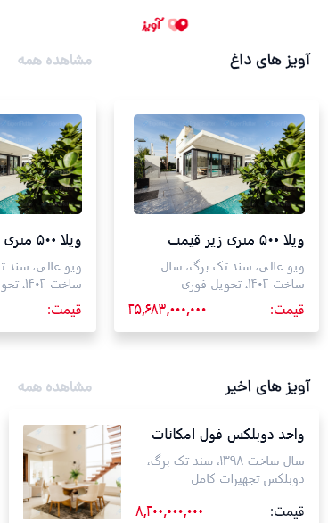

# Aviz

A Flutter-based classified marketplace application inspired by platforms such as Divar, designed for browsing, searching, and discovering product listings through a modern mobile interface.

## Overview

Aviz is a mobile marketplace application developed with Flutter and Dart.

The application provides users with a platform for discovering classified advertisements, browsing promotional and recent listings, searching for products, and interacting with marketplace content.

The project uses a feature-based architecture with separate data sources, repositories, BLoC state management, and presentation layers. It also integrates REST APIs, local data storage, online payment services, and deep linking capabilities.

## Features

* Browse classified advertisements
* View hot and promotional listings
* Browse recent advertisements
* Search for listings
* Filter and discover marketplace content
* View product and advertisement information
* REST API integration
* Network image loading and caching
* Local data persistence
* Online payment integration
* Deep linking support
* Responsive mobile UI
* Custom typography and Material Design components

## Technologies

* **Flutter & Dart** — Cross-platform mobile application development
* **BLoC / Flutter BLoC** — State management
* **Dio** — HTTP client and REST API communication
* **Dartz** — Functional error handling with `Either`
* **GetIt** — Dependency injection
* **Hive** — Local data storage
* **ZarinPal** — Online payment integration
* **Uni Links** — Deep linking
* **Cached Network Image** — Network image caching
* **Intl** — Number and date formatting
* **Material Design** — UI components and application theming
* **Dana** — Custom application font

## Architecture

The project follows a feature-based structure that separates presentation, business logic, and data-access responsibilities.

The main data flow is organized around:

```text
UI
 ↓
BLoC
 ↓
Repository
 ↓
Data Source
 ↓
REST API
```

Dependency injection is handled using GetIt, while Dio is used as the HTTP client for communicating with backend services.

### Data Layer

The data layer is organized into separate components:

* **Data Sources** — Responsible for communicating with remote services
* **Repositories** — Provide an abstraction over data sources
* **Models** — Represent application data
* **Dartz Either** — Used for representing successful and failed data operations

### State Management

BLoC is used to manage application state and separate business logic from the presentation layer.

For example, the Home feature handles:

* Initial state
* Loading state
* Successful data requests
* Hot promotion data
* Latest promotion data

## Application Structure

```text
lib/
├── Constants/
│   ├── color_constants.dart
│   └── string_constants.dart
│
├── DI/
│   └── di.dart
│
├── Features/
│   ├── Home/
│   │   ├── bloc/
│   │   ├── data/
│   │   │   ├── datasource/
│   │   │   ├── model/
│   │   │   └── repository/
│   │   └── view/
│   │
│   └── Search/
│       ├── bloc/
│       ├── data/
│       │   ├── datasource/
│       │   └── repository/
│       └── view/
│
├── NetworkUtil/
│   ├── api_exception.dart
│   └── dio_provider.dart
│
├── source/
│   ├── home_source/
│   └── search_source/
│
├── Util/
│   └── number_extention.dart
│
└── Widgets/
    ├── aviz_custom_textfiled.dart
    ├── chached_network_image.dart
    ├── hot_promotion_card.dart
    └── normal_promotion_card.dart
```

## Dependency Injection

GetIt is used to manage dependencies and provide application services through a centralized dependency injection container.

The application registers the Dio HTTP client, remote data sources, and repositories during application startup.

```dart
locator.registerSingleton<Dio>(DioProvider.createDio());

locator.registerFactory<IHomeDatasource>(
  () => HomeRemoteDatasource(locator.get()),
);

locator.registerFactory<IHomeRepository>(
  () => HomeRepository(locator.get()),
);
```

This approach keeps dependencies separated from the UI and makes the data layer easier to maintain and test.

## Networking

Dio is used as the primary HTTP client for communicating with remote APIs.

The networking layer contains:

* Dio configuration
* API exception handling
* Remote data sources
* Repository abstractions

This structure keeps API-related responsibilities separated from the presentation layer.

## Local Storage

Hive is included for local data persistence, providing lightweight local storage for application data.

The project also uses Hive's Flutter integration and code generation support.

## Online Payments

The application includes ZarinPal integration for handling online payment functionality.

## Deep Linking

Uni Links is used to provide deep linking capabilities, allowing the application to respond to links that can navigate users into specific parts of the application.

## Screenshots

### Home



## Getting Started

### Prerequisites

Make sure you have the following installed:

* Flutter SDK
* Dart SDK
* Android Studio or VS Code
* Git

### Installation

Clone the repository:

```bash
git clone https://github.com/MobinaFetrati/aviz-marketplace.git
```

Navigate to the project directory:

```bash
cd aviz-marketplace
```

Install dependencies:

```bash
flutter pub get
```

Run the application:

```bash
flutter run
```

## Platforms

The application is developed with Flutter and is structured for mobile platforms.

* Android
* iOS

## Project Purpose

This project was developed to demonstrate the implementation of a real-world marketplace application using Flutter.

It focuses on modular application structure, API integration, state management, dependency injection, local persistence, payment integration, and reusable UI components.

## Author

**Mobina Fetrati**

Flutter Developer | Mobile Application Developer

GitHub: [MobinaFetrati](https://github.com/MobinaFetrati)
